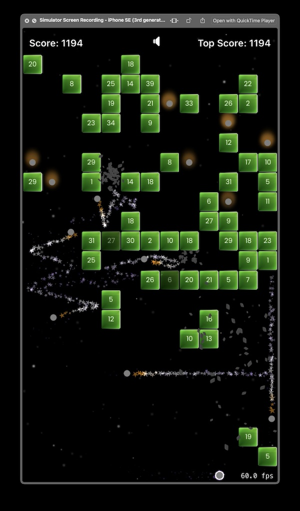

# Brichs Shooter 

### A basic Shooter game which is written in Swift.

 

### Usage:
##### ✅ Download the source.
##### ✅ Set your developer account.
##### ✅ Build and run.

#### Contribution:
##### I accept the helps to fix the bugs and improve the functionality with open arms, Just make it cool!

### License:
PersianJustify is released under the MIT license. See [LICENSE](https://github.com/HappyIosDeveloper/Bricks-Shooter?tab=MIT-1-ov-file) for details. 
